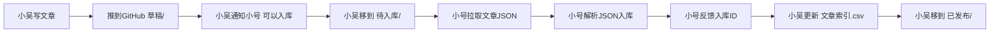

# 文章入库对接说明

> 本文档供负责文章入库的同事（小号）阅读，了解如何与小吴（AI助手）对接，将SEO文章入库。

---

## 一、对接双方

| 角色 | 名称 | 职责 |
|------|------|------|
| 文章撰写 | 小吴（AI助手） | 根据关键词库撰写SEO文章，输出JSON，推送到GitHub |
| 文章入库 | 小号（同事） | 从GitHub拉取文章，解析JSON，写入数据库 |

---

## 二、文章来源与获取方式

### GitHub 仓库地址
> **https://github.com/Fange-felix/br_wz**

### 目录结构
```
br_wz/
├── 草稿/硅PU球场/        ← 新文章写好后先放这里，等待入库
├── 待入库/硅PU球场/      ← 小吴通知小号：可以入库了，文章移到这里
├── 已发布/硅PU球场/      ← 入库完成后，小吴将文章移到这里
├── 作废/硅PU球场/        ← 废弃文章
├── 文章模板.json           ← 新建文章时复制的模板
├── 文章索引.csv           ← 所有文章的汇总索引（入库状态一目了然）
└── 入库对接文档.md        ← 本文档，说明入库技术细节
```

### 小号获取文章的方式
**方式一（推荐）：直接拉取 GitHub 仓库**
```bash
git clone https://github.com/Fange-felix/br_wz.git
# 每次入库前先拉最新
git pull
```

**方式二：通过 GitHub API 读取**
```bash
# 列出待入库目录下的所有文章（需要 Personal Access Token，小号自己生成）
curl -s "https://api.github.com/repos/Fange-felix/br_wz/contents/待入库/硅PU球场" \
  -H "Authorization: Bearer ghp_你的TOKEN"
```

---

## 三、对接流程（标准步骤）



### 每一步说明

**Step 1 — 小吴写文章**
- 基于 BR 关键词库选词
- 按 `文章模板.json` 结构输出
- 保存到 `草稿/硅PU球场/BR-XXX-文章标题.json`

**Step 2 — 小吴通知小号**
- 方式：微信/企微/邮件（双方约定）
- 内容：告知有新文章待入库，已移到 `待入库/` 目录

**Step 3 — 小号拉取文章**
- `git pull` 拉最新
- 读取 `待入库/硅PU球场/` 下的 JSON 文件

**Step 4 — 小号解析 JSON 入库**
- 参考 `入库对接文档.md` 中的 JSON 结构说明
- 参考数据库表设计（同文档中有建表 SQL）

**Step 5 — 小号反馈入库结果**
- 告知小吴：哪些文章已入库、对应的数据库 ID
- 小吴更新 `文章索引.csv` 中的 `是否入库` 和 `入库ID` 字段

**Step 6 — 小吴移动文章**
- 入库完成后，将文章从 `待入库/` 移到 `已发布/`

---

## 四、文章 JSON 关键字段（入库必读）

小号入库时，主要关注以下字段：

| 数据库字段 | JSON 路径 | 说明 |
|-----------|-----------|------|
| `article_id` | `article_id` | 文章编号，如 `BR-001`，唯一 |
| `industry` | `industry` | 所属行业，如 `硅PU球场` |
| `status` | `status` | 当前状态（`草稿`/`待入库`/`已发布`/`作废`） |
| `primary_keyword` | `meta_info.primary_keyword` | 主关键词 |
| `secondary_keywords` | `meta_info.secondary_keywords` | 副关键词（数组） |
| `title_tag` | `meta_info.title_tag` | 页面 Title 标签 |
| `meta_description` | `meta_info.meta_description` | 页面 Meta 描述 |
| `h1` | `content.h1` | 文章 H1 标题 |
| `h2_sections` | `content.h2_sections` | H2 章节数组（含 title + content） |
| `created_at` | `created_at` | 创建日期 |
| `updated_at` | `updated_at` | 更新日期 |
| `imported_to_db` | `imported_to_db` | 是否已入库（`true`/`false`） |

> 💡 **完整 JSON 结构**请参考仓库根目录的 `文章模板.json`，每个字段都有注释说明。

---

## 五、文章索引 CSV 说明

`文章索引.csv` 是双方协作的核心文件，小号入库后**必须告知小吴更新**。

| 列名 | 说明 | 小号需要更新的列 |
|------|------|----------------|
| 文章编号 | 如 `BR-001` | — |
| 主关键词 | SEO 主词 | — |
| 副关键词 | 用 `|` 分隔 | — |
| 行业 | 如 `硅PU球场` | — |
| 文章状态 | 草稿/待入库/已发布/作废 | — |
| 存放路径 | 相对路径 | — |
| 是否入库 | `是`/`否` | ✅ 入库后告知小吴改此处 |
| 入库ID | 数据库中的 ID | ✅ 入库后告知小吴填写 |
| URL_Slug | URL 别名 | — |

---

## 六、联系方式

| 事项 | 联系人 | 方式 |
|------|--------|------|
| 文章撰写进度 | 小吴（AI助手） | 通过 WorkBuddy 对话 |
| 入库问题/反馈 | 小号（同事） | 微信/企微（双方约定） |
| 新文章通知 | 小吴 → 小号 | 微信/企微通知 |

---

## 七、注意事项

1. **编码问题**：所有 JSON 文件均为 UTF-8 编码，入库时请注意数据库编码设置
2. **文章移动规则**：只有小吴才能移动文章文件（保持目录结构一致性）
3. **索引同步**：小号入库后务必告知小吴，由小吴更新 `文章索引.csv`
4. **文章编号唯一**：`BR-XXX` 编号不可重复，小吴统一分配
5. **疑问对接**：入库过程中有任何技术问题，小号可以直接在 GitHub 提 Issue，或微信找小吴

---

*最后更新：2026-06-28*
*维护人：小吴（AI助手）*
